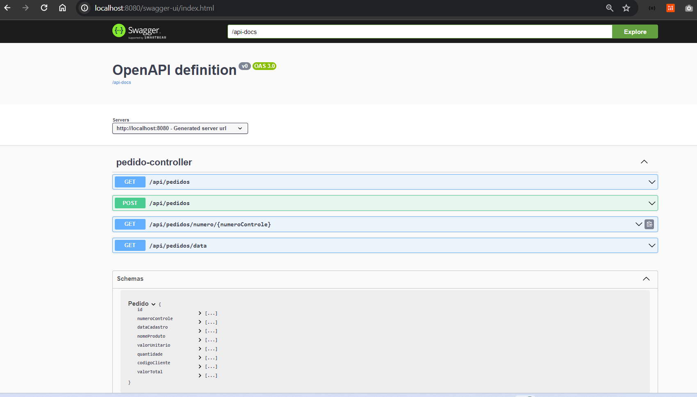

# API para a recepção de pedidos dos clientes.

(MODELO ORGANIZACIONAL DE PROJETO)

(APLICADO EM TODOS OS CLIENTE, MODELO DE README ONDE TRABALHEI EM CLIENTES INTERNACIONAIS) 

(TRADUZIDO PARA ESSE TESTE, AQUI EM PORTUGUÊS)

Sistema com finalidade de consultas de pedidos âmbito (Empresa Do-Test), atendo às necessidades apresentadas para o cliente.

## Principais Tecnologias Usadas - API (Microsserviços Backend)


---

## Pré-requisitos Ambiente 


---

## Pré-requisitos - VDI

- [Dbeaver](#)
- [Docker](#)
- [Intelij](https://www.eclipse.org/downloads/download.php?file=/technology/epp/downloads/release/2022-09/R/eclipse-jee-2022-09-R-win32-x86_64.zip)
- [JDK 11](https://download.oracle.com/otn/java/jdk/8u202-b08/1961070e4c9b4e26a04e7f5a083f551e/jdk-8u202-windows-x64.exe)
- [Maven 3.8](https://archive.apache.org/dist/maven/maven-3/)
- [Notepad++](https://github.com/notepad-plus-plus/notepad-plus-plus/releases/download/v8.5.2/npp.8.5.2.Installer.x64.exe)
- [Plugin do Lombok](https://projectlombok.org/downloads/lombok.jar)
- [Test Runner](#)

## Configuração de Ambiente 

- Baixar o código da aplicação no diretório de trabalho de escolha própria

```sh
$ git clone https://github.com/kleberimeusp/Do-Test.git
```

## Upload database MySQL em Docker

Acesse o container do banco de dados e importe o banco de dados.

```shell
docker exec -it db bash
mysql -u root -proot
exit;
mysql -uroot -proot navetse < /db/pedidosdb.sql
```

- Atualização todas as versões de um projeto modular com um único comando no **Maven**?

```sh
$ mvn clean install
```

## Modo de acesso ao sistema/módulo (urls)
O acesso ao sistema pode ser efetuado por meio dos links abaixo:
- Localhost: [Swagger máquina local](http://localhost:8080/swagger-ui/index.html)
  
- Desenvolvimento: [XXX](x)
- Homologação: [XXX](x)
- QA: [XXX](x)
- Produção: [XXX](x)

---

## Arquitetura de Referência (Empresa Do-Test)

- Link do material [clique aqui](#)
